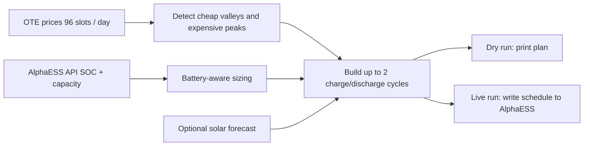

# AlphaESS Charging Optimizer

Optimize AlphaESS battery charging and discharge schedules against Czech OTE day-ahead prices.

It reads the next day's 15-minute electricity prices, checks the current battery state, finds cheap charge windows and expensive discharge windows, and programs the resulting schedule into AlphaESS.

## At A Glance



- It is dynamic, not fixed-time: it reacts to the actual shape of each day's prices.
- It is battery-aware: it sizes windows using current SOC and usable capacity.
- It works within AlphaESS limits: up to 2 charge windows and 2 discharge windows per day.
- It can optionally account for solar forecast so the system avoids unnecessary grid charging.

## Quick Start

### 1. Install dependencies

```bash
git clone https://github.com/michaelkrasa/AlphaESS-charging-optimizer.git
cd AlphaESS-charging-optimizer
uv sync
```

### 2. Configure credentials

```bash
cp .env.example .env
```

Fill in your AlphaESS Open API credentials in `.env`:

```dotenv
APP_ID=your_alphaess_app_id
APP_SECRET=your_alphaess_app_secret
SERIAL_NUMBER=your_ess_serial_number
```

Optional deployment settings for Lambda are also documented in `.env.example`.

### 3. Run it

The simplest way to run it is:

```bash
uv run python main.py --help
```

Common examples:

```bash
# Live run for today in the configured timezone
uv run python main.py

# Dry run for today
uv run python main.py --dry-run

# Dry run for a specific calendar date
uv run python main.py --dry-run --date 2026-04-08

# Dry run for a day in the current month
uv run python main.py --dry-run --date 15
```

The module entry point still works too:

```bash
uv run python -m src.optimizer --dry-run
```

## Example Output

In a dry run, you should expect logs along these lines:

```text
Battery SOC: 42.0%
Dynamic optimization for 2026-04-08 [DRY RUN]
Daily stats: mean=104, min=51, max=188
Cycle: Charge 02:00-04:30 -> Discharge 17:00-20:00
[DRY RUN] Would set charging schedule: ...
[DRY RUN] Would set discharge schedule: ...
```

The exact windows depend on that day’s prices, current battery SOC, and optional solar forecast input.

## CLI Reference

```bash
uv run python main.py [--dry-run] [--date DAY|YYYY-MM-DD] [--config PATH]
```

- `--dry-run`: analyze and print schedules without changing anything in AlphaESS
- `--date`: accepts either a day of month like `15` or a full ISO date like `2026-04-08`
- `--config`: override the default config file path (`config.yaml`)

## Configuration

Main runtime settings live in `config.yaml`.

Important keys:

- `timezone`: determines what "today" means for optimization
- `charge_rate_kw`: battery charge rate
- `price_multiplier`: valley/peak sensitivity
- `min_soc` and `max_soc`: discharge floor and charge target
- `solar_forecast_enabled`: enables the Open-Meteo based solar forecast path

The included default config enables solar forecast support and reads the extra settings from `solar_config.yaml`.

## AlphaESS API Notes

This project uses the AlphaESS Open API through the `alphaessopenapi` package.

- API credentials are read from `.env`
- Live runs update the device charging and discharge schedules
- Dry runs do not send schedule changes
- The integration code is in `src/ess_client.py`
- The optimizer reads current SOC and usable battery capacity before building a plan

If you need to understand or change the AlphaESS integration, start in `src/ess_client.py`.

## Project Structure

The most important files are:

- `main.py`: simplest local entry point
- `src/optimizer.py`: main orchestration and CLI argument handling
- `src/price_analyzer.py`: valley and peak detection
- `src/battery_manager.py`: SOC and battery sizing logic
- `src/ess_client.py`: AlphaESS API reads and schedule writes
- `src/price_cache.py`: cache for fetched price data
- `config.yaml`: runtime tuning
- `solar_config.yaml`: solar forecast settings
- `lambda_handler.py`: AWS Lambda entry point
- `tests/`: regression and scenario coverage

If you are new to the repo, `main.py` -> `src/optimizer.py` -> `src/ess_client.py` is the shortest useful path through the code.

## Testing

```bash
uv run pytest tests/ -v
uv run pytest tests/test_ess.py -v
uv run pytest tests/test_december_2025.py -v
uv run pytest tests/test_january_2026.py -v
```

## AWS Lambda

Deploy with:

```bash
./deploy-lambda.sh
```

This uses:

- `lambda_handler.py` as the entry point
- `Dockerfile` for the Lambda container image
- AWS settings from `.env`

## Notes

- Target market: Czech OTE day-ahead prices with 15-minute slots
- AlphaESS API limitation: at most 2 charge windows and 2 discharge windows per day
- For scheduled automation, run shortly after the next-day prices are available
- Default timezone handling comes from `config.yaml`, not from your shell timezone
